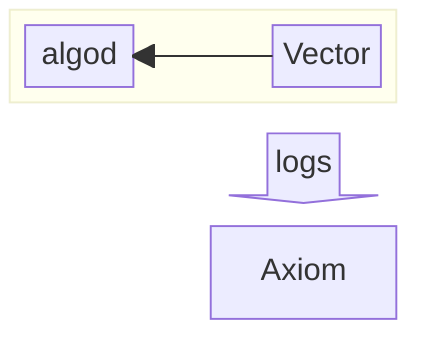

# Node Monitoring

The staking rewards initiative has been very successful in incetivising Algo holders to run validator nodes and participate in consensus. This is great and helps massively with the decentralisation and security of the network.

The hardware requirements for running a node is low, so it's quite feasible for someone to run a node from their home. This is great for decentralisation, however home internet and power availability is going to be less reliable than a data center with various levels of redundancy in place.

To act as a responsible node runner, you should have visibility into the health of your node, especially if you run a node at home.

Part of that is being aware of events (loss of power or connectivity for example) that may impact the ability for your node to participate correctly, so it's important for you to have a system for tracking health and receive alerts when the health is impacted.

This repo contains some information and configuration, which enables you to ingest node telemetry into your own log aggregation system for querying, monitoring and alerting purposes.

This setup utilises: [Vector](https://github.com/vectordotdev/vector) (for log filtering, transformation and shipping), [Axiom](https://axiom.co/) (for log aggregation, querying, dashboards and notifications).

The configuration looks something like below:

[See here for the Axiom setup](./axiom/README.md)

[See here for the Vector setup](./vector/README.md)

## Initial Idea

Initiatially I wanted to build a simple tool to detect when your node is offline and automatically send a keyreg transaction to take offline the accounts linked to the node.

Such a tool would be mainly useful for solo stakers with relatively small Algo balances.

## Options

1. Pre signed keyreg transactions
The idea here is to create a keyreg transaction, sign it, store it and send it when the node is detected as offline.

The trouble is that we don't know when the node might go offline (which round), so we'd need a very large validity window for this transaction. Algod assets the round range is 1000 blocks or less (approx 45mins), so we'd need to store more than a single transaction to cover a larger window.

We could build a tool to generate one transaction for each 1000 block range in a given time window, however the sheer volume of transactions required to review and sign would be a UX nightmare especially on a ledger device.

As a result this option is not feasible.

1. Use a delegated logic sig

Delegated LogicSigs are a powerful (and also potentially dangerous) feature, which allows one account to sign transactions on behalf of another account using a TEAL program.

This would likely work well for the above scenario, however delegated logic sigs require the teal program to be signed. No wallets currently support signing and there is also no ledger support. The only way currently to sign a delegated logic sig is by using the private key directly, which is not possible with a ledger device. It's probably fair to assume that a large portion of online stake is held on ledger devices (certainly true in my case).

Possible, but not really feasible.
