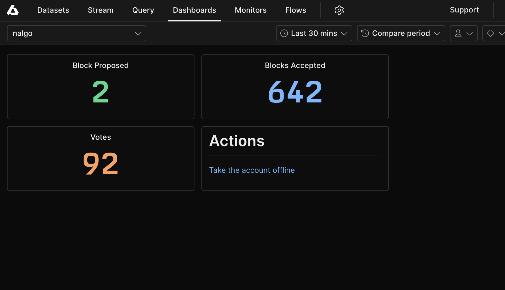
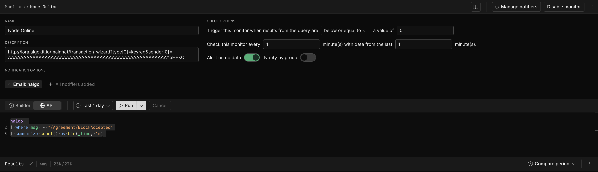

# Axiom Setup

Axiom is hosted log aggregation tool, which has support for querying, creating dashboards and sending notifications. It also has a fairly permissive free tier.

## Installation

Axiom is a hosted product, so no installation is required. The following steps will allow you to start ingesting logs:

1. Sign up at [https://axiom.co/](https://axiom.co/).
1. Create a new dataset. The name will be used to configure Vector.
1. Create a new API key. The key will be used to configure Vector.

## Configuration

Once you have logs available in Axiom you can then configure Axiom to your needs.

Unfortunately Axiom doesn't have an API or a mechanism to import dashboards or monitors, so you'll need to manually create them. The below configuration is a simple one you can use to check your node is online using the `/Agreement/BlockAccepted` event.

**Dashboard**



`Blocks Proposed` statistic
```apl
nalgo
| where msg =~ "/Agreement/BlockProposed"
| summarize count() by bin_auto(_time)
```

`Blocks Accepted` statistic
```apl
nalgo
| where msg =~ "/Agreement/BlockAccepted"
| summarize count() by bin_auto(_time)
```

`Votes` statistic
```apl
nalgo
| where msg =~ "/Agreement/VoteSent"
| summarize count() by bin_auto(_time)
```

`Actions` note
```md
# Actions
[Take the account offline](http://lora.algokit.io/mainnet/transaction-wizard?type[0]=keyreg&sender[0]=YOUR_ADDRESS_GOES_HERE)
```

**Monitor**

`Node Online` monitor



```apl
nalgo
| where msg =~ "/Agreement/BlockAccepted"
| summarize count() by bin(_time, 1m)
```
